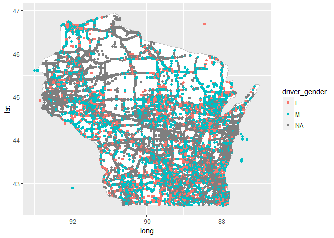
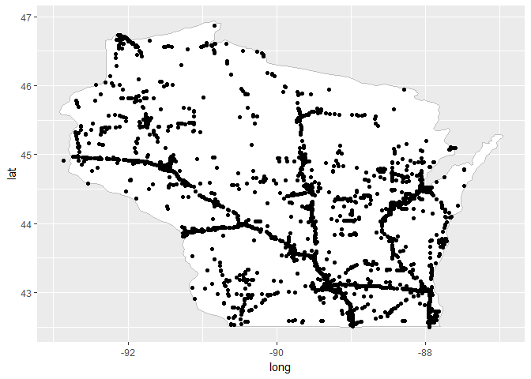

# Initial coordinate maps
Todd Marino  
March 15, 2018  
Data downloaded from here:
https://stacks.stanford.edu/file/druid:py883nd2578/WI-clean.csv.gz


```r
library(readr)
library(dplyr)
library(ggplot2)
trafficStops <- read_csv("WI_cleaned.csv")

##Getting data to map the border of Wisconsin
wisc <- map_data("state") %>% 
  filter(region == "wisconsin")

##Some of the coordinates are wrong. This fixes or removes the obvious errors
cleanedData <- trafficStops %>% 
  filter(!is.na(lat), !is.na(lon)) %>% 
  mutate(fixedLon = ifelse(lon > 0, -lon, lon)) %>% 
  filter(lat < 47, lat > 42.3, fixedLon > -93, fixedLon < -87)

arrestedData <- cleanedData %>% filter(is_arrested == TRUE)

##creating the ggplot object and Wisconsin map border
WI <- ggplot(wisc) + 
  geom_polygon(aes(long, lat, group = group), fill = "white", color = "grey") 
```


```r
##plotting all data points that have coordinates, with different color for gender
WI + geom_point(aes(fixedLon, lat, color = driver_gender ), data = cleanedData)
```

<!-- -->


```r
##plotting all data points that have coordinates and that led to an arrest
arrestedData <- cleanedData %>% filter(is_arrested == TRUE)
WI + geom_point(aes(fixedLon, lat ), data = arrestedData) 
```

<!-- -->
